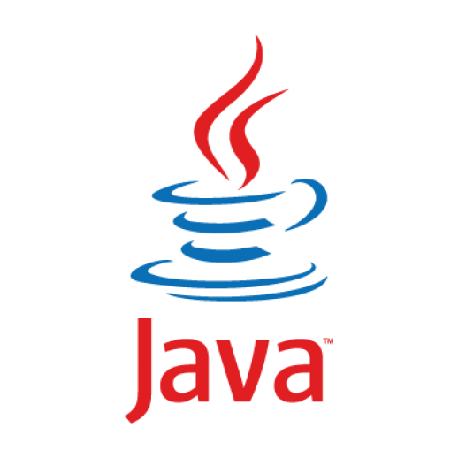
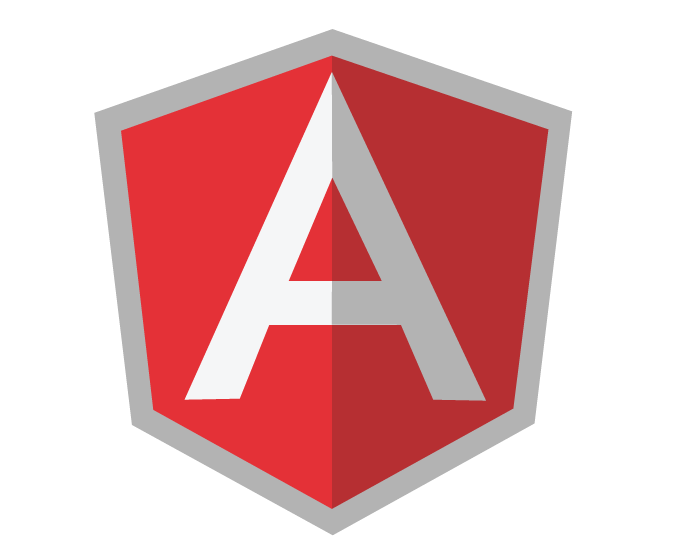
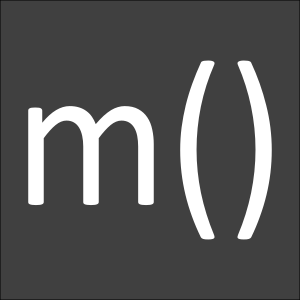

# Programming Languages

Here, we'll mention the languages that will be considered for this project. For each language, we'll point out at least three of its definitive characteristics/features. 

These characteristics will be used to as a guide for picking its anime character.

## C Programming Language

<<<<<<< HEAD
<table width="100%">
    <tr>
        <td width="30%">
            
        </td>
        <td width="70%" style="vertical-align:top;padding-top: 4%;">
            <h3>C Programming</h3>
        </td>
    </tr>
</table>

## C++

<table width="100%">
    <tr>
        <td width="30%">
            
        </td>
        <td width="70%" style="vertical-align:top;padding-top: 4%;">
            <h3>C++ Programming</h3>
        </td>
    </tr>
</table>

## Python

<table width="100%">
    <tr>
        <td width="30%">
            
        </td>
        <td width="70%" style="vertical-align:top;padding-top: 0%;">
            <h3>Python Programming</h3>
        </td>
    </tr>
</table>

### PyPy

<table width="100%">
    <tr>
        <td width="30%">
            
        </td>
        <td width="70%" style="vertical-align:top;padding-top: 0%;">
            <h3>PyPy Programming</h3>
        </td>
    </tr>
</table>

## Java

<table width="100%">
    <tr>
        <td width="30%">
            
        </td>
        <td width="70%" style="vertical-align:top;padding-top: 4%;">
            <h3>Java Programming</h3>
        </td>
    </tr>
</table>

## C#

<table width="100%">
    <tr>
        <td width="30%">
            
        </td>
        <td width="70%" style="vertical-align:top;padding-top: 4%;">
            <h3>Csharp Programming</h3>
        </td>
    </tr>
</table>

## Ruby

<table width="100%">
    <tr>
        <td width="30%">
            
        </td>
        <td width="70%" style="vertical-align:top;padding-top: 4%;">
            <h3>Ruby Programming</h3>
        </td>
    </tr>
</table>

## PHP

<table width="100%">
    <tr>
        <td width="30%">
            
        </td>
        <td width="70%" style="vertical-align:top;padding-top: 0%;">
            <h3>PHP Programming</h3>
        </td>
    </tr>
</table>

## Go

<table width="100%">
    <tr>
        <td width="30%">
            
        </td>
        <td width="70%" style="vertical-align:top;padding-top: 0%;">
            <h3>Go Programming</h3>
        </td>
    </tr>
</table>

## JavaScript

<table width="100%">
    <tr>
        <td width="30%">
            
        </td>
        <td width="70%" style="vertical-align:top;padding-top: 4%;">
            <h3>JavaScript Programming</h3>
        </td>
    </tr>
</table>

### ReactJS

<table width="100%">
    <tr>
        <td width="30%">
            
        </td>
        <td width="70%" style="vertical-align:top;padding-top: 2%;">
            <h3>ReactJS Programming</h3>
        </td>
    </tr>
</table>

### AngularJS

<table width="100%">
    <tr>
        <td width="30%">
            
        </td>
        <td width="70%" style="vertical-align:top;padding-top: 4%;">
            <h3>AngularJS Programming</h3>
        </td>
    </tr>
</table>

### MithrilJS

<table width="100%">
    <tr>
        <td width="30%">
            
        </td>
        <td width="70%" style="vertical-align:top;padding-top: 4%;">
            <h3>Mithril Programming</h3>
        </td>
    </tr>
</table>

### NodeJS

<table width="100%">
    <tr>
        <td width="30%">
            
        </td>
        <td width="70%" style="vertical-align:top;padding-top: 4%;">
            <h3>NodeJS Programming</h3>
        </td>
    </tr>
</table>