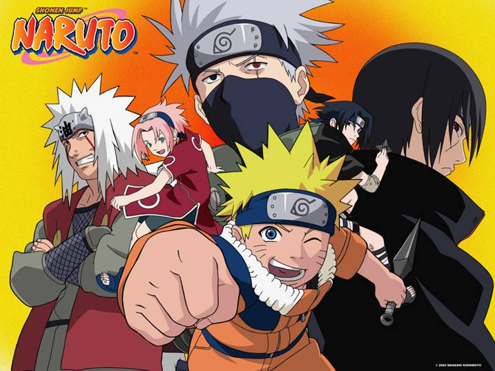

# Naruto

Naruto is a Japanese Manga that tells the story of Naruto Uzumaki, a young ninja who searches for recognition and dreams to become the Hokage.

See more on [Wikipedia](https://en.wikipedia.org/wiki/Naruto) or even better, its very own [Wikia](http://naruto.wikia.com/wiki/Naruto_Uzumaki).

So, how do our programming languages compare with these characters? Let's proceed ...

## C

## C++

## Python

### PyPy

## Java

## C#

## Ruby

## PHP

## Go

## JavaScript

### ReactJS

### AngularJS

### MithrilJS

### NodeJS

